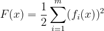
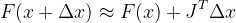
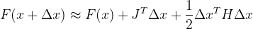
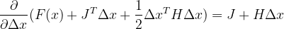
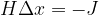
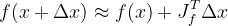
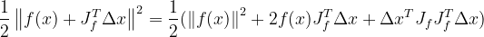
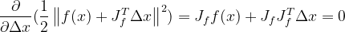
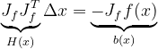

# Optimization in Visual SLAM

Modern SLAM backend can be categorized into two types which are filter-based approach or graph/optimization-based approach. As the name suggests, the former method utilize the theory of Markov chain and propagates the states based on previous states. As for the optimization-based approach, the problem is modeled as a minimization of specific cost function, such as least square estimation.

## Least Square Estimation
In a graph-based SLAM, the pose and measurements can be visualized as the figure above where the rectangular block resembles constraints from measurements and each node representing target variable.
A more intuitive way of understanding the relationship of least square estimation and graph-based slam is that we are looking for the "best" target variable for the given measurements or constraints.
Therefore, it is important to understand the optimization process in graph-based SLAM.

From the equation above, the cost function, _**F(x)**_ consists of _**m**_ residual functions _**fi(x)**_.
The residual functions can be the difference between an predicted value and actual measurements.
As mentioned before, we are seeking the optimum value of _**x**_ that will produce the lowest cost function.
In order to do so, several options are available to solve this non-linear least square problem such as _**gradient descent**_, _**Newton's method**_, _**Gauss-Newton**_, and _**Levenberg-Marquardt algorithm**_.

## Gradient Descent
Similar to other methods mentioned above, gradient descent is an iterative method to solve non-linear least square problem. Just like the name suggests, this method search for a "direction" to minimize the cost function. A more intuitive way of visualizing it is to think of the gradient of the cost function as the opposite "direction" and incrementally adjust the target variables towards it until convergence occurs.
First order Taylor expansion is first performed on the cost function.

The Jacobian matrix, _**J**_ is the first order partial derivative of the function _**F(x)**_ with respect to variable _**x**. Since only the first order expansion is performed, the desired descent direction will be negative gradient which is _**-J**_ in this case. Next, we will have to decide how large is the step, _**λ**_ that we would like to take for each iteration. This so called step or learning rate in nomenclature of deep learning or machine learning is a hyperparameter that required to be tuned. 

Cons:
* Will oscillates around the optimal point.
* Slow converging speed.

## Newton's Method
Instead of first order Taylor expansion, the second order expansion term is kept in Newton's Method

In the equation above, the increment of _**x**_ can be calculated with Jacobian Matrix, _**J**_ and Hessian Matrix, _**H**_, which is the second order partial derivative of _**F(x)**_ with respect to _**x**_. Unlike gradient descent which utilize first order expansion, Newton's method is less "greedy" and has less oscillation, thus decreasing number of iteration requried. However, the calculation of Hessian is computationally expensive and is often preferred to be avoided.

Cons:
* Calculation of Hessian Matrix, _**H**_ is computationally expensive.

## Gauss-Newton Algorithm
Gauss-Newton Algorithm is a modification of Newton's method and can only be used to minimize a sum of squared function values. Unlike the previous methods, Guass-Newton Algorithm performs first order Taylor expansion on the residual function instead of the cost function.

_**Note**_ : The Jacobian Matrix, _**Jf**_ above is the partial derivative of residual function, _**f(x)**_ with respect to _**x**_.

The expanded residual functions are then squared and divide by half just like cost function from previous methods. By doing so, we will get the equation below.

Next, partial derivation with respect to _**Δx**_ is performed and is set to zero to find the minimum value of the squared residual functions.

Finally, the equation _**HΔx=b**_ or known as the Normal equation is obtained.  
## Reference
[1] Y.He, X.Gao, C.Kun. Visual SLAM Online Course. shenlanxueyuan.com/my/course/225

[2] X.Gao, T.Zhao, Y.Liu, Q. Yan. 14 Lectures on Visual SLAM: From Theory to Practice. github/gaoxiang12/slambook-en