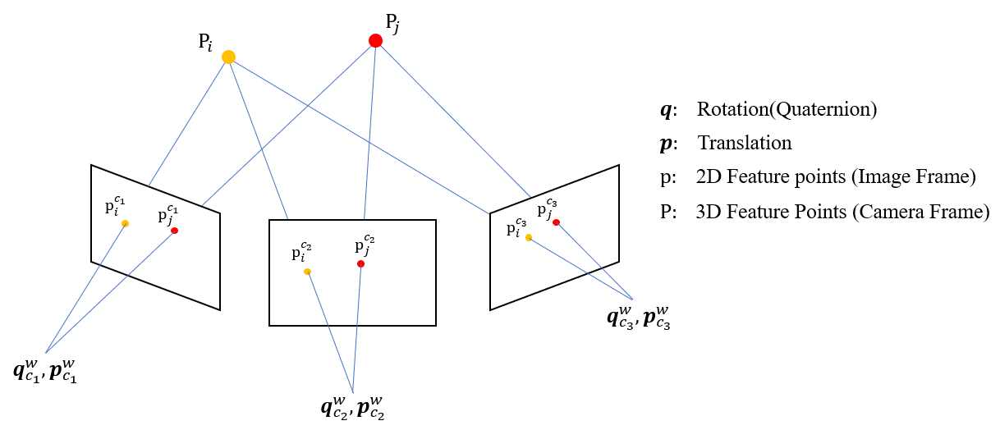

# Bundle Adjustment in Visual SLAM

Bundle Adjustment plays an important role in many modern computer vision application which consists of multi-view geometric constraint and is often used in final refinement of pose estimation or 3D reconstruction.
In visual SLAM, it is often used to calculate the camera pose given detected feature points in each few frames.

In the figure above, we have feature points detected in a few camera frames. For each 3D feature points, 'bundle' of light rays are projected from optical center of camera frames through the corresponding feature points in pixel frame and intersects at the 3D coordinates.
However, in reality, it is close to impossible for these 'bundle' of light rays to completely converge at one point due to noise in camera measurements. Therefore, iterative 'adjustment' is required to ensure all the rays can reach the optimal convergence.

## Reference
[1] Y.Chen, Y.Chen, G.Wang. Bundle Adjustment Revisited. arxiv.org/abs/1912.03858  
[2] Y.He, X.Gao, C.Kun. Visual SLAM Online Course. shenlanxueyuan.com/my/course/225