# Optimization in Visual SLAM

Modern SLAM backend can be categorized into two types which are filter-based approach or graph/optimization-based approach. As the name suggests, the former method utilize the theory of Markov chain and propagates the states based on previous states. As for the optimization-based approach, the problem is modeled as a minimization of specific cost function, such as least square estimation.

## Least Square Estimation
In a graph-based SLAM, the pose and measurements can be visualized as the figure above where the rectangular block resembles constraints from measurements and each node representing target variable.
A more intuitive way of understanding the relationship of least square estimation and graph-based slam is that we are looking for the "best" target variable for the given measurements or constraints.
Therefore, it is important to understand the optimization process in graph-based SLAM.

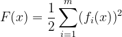

From the equation above, the cost function, _**F(x)**_ consists of _**m**_ residual functions _**fi(x)**_.
The residual functions can be the difference between an predicted value and actual measurements.
As mentioned before, we are seeking the optimum value of _**x**_ that will produce the lowest cost function.
In order to do so, several options are available to solve this non-linear least square problem such as _**Steepest/gradient descent**_, _**Newton's method**_, _**Gauss-Newton**_, and _**Levenberg-Marquardt algorithm**_. These methods calculate an increment/decrement, _**Δx**_ and updates the target variable _**x**_ until the cost function _**F(x)**_ becomes small enough or converge.

## Steepest/Gradient Descent
Similar to other methods mentioned above, gradient descent is an iterative method to solve non-linear least square problem. Just like the name suggests, this method search for a "direction" to minimize the cost function. A more intuitive way of visualizing it is to think of the gradient of the cost function as a "direction" and we want to incrementally adjust the target variables towards the opposite direction in each iteration until convergence occurs.
To calculate the "direction", first order Taylor expansion is first performed on the cost function.

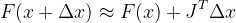

The Jacobian matrix, _**J**_ is the first order partial derivative of the function _**F(x)**_ with respect to variable _**x**_. Since only the first order expansion is performed, the desired descent direction will be negative gradient which is _**-J**_ in this case. Next, we will have to decide how large is the step, _**λ**_ that we would like to take for each iteration. This so called step or learning rate in nomenclature of deep learning or machine learning is a hyperparameter that required to be tuned. 

Cons:
* Will oscillates around the optimal point.
* Slow converging speed.

## Newton's Method
Instead of first order Taylor expansion, the second order expansion term is kept in Newton's Method
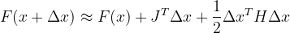

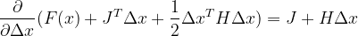

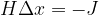

In the equation above, the increment of _**x**_ can be calculated with Jacobian Matrix, _**J**_ and Hessian Matrix, _**H**_, which is the second order partial derivative of _**F(x)**_ with respect to _**x**_. Unlike gradient descent which utilize first order expansion, Newton's method is less "greedy" and has less oscillation, thus decreasing number of iteration requried. However, the calculation of Hessian is computationally expensive and is often preferred to be avoided.

Cons:
* Calculation of Hessian Matrix, _**H**_ is computationally expensive.

## Gauss-Newton Algorithm
Gauss-Newton Algorithm is a modification of Newton's method and can only be used to minimize a sum of squared function values. Unlike the previous methods, Guass-Newton Algorithm performs first order Taylor expansion on the residual function instead of the cost function.

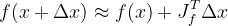

_**Note**_ : The Jacobian Matrix, _**Jf**_ above is the partial derivative of residual function, _**f(x)**_ with respect to _**x**_.

The expanded residual functions are then squared and divide by half just like cost function from previous methods. By doing so, we will get the equation below.

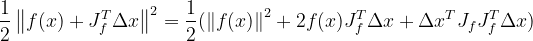

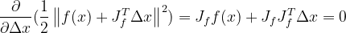

Next, partial derivation with respect to _**Δx**_ is performed and is set to zero to find the minimum value of the squared residual functions.

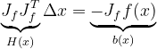

Finally, the equation _**HΔx=b**_, also known as the Normal equation is obtained. 
As we can see, the final equation is somewhat similar to the Newton's method with the difference being _**H**_ is approximated as _**JfJTf**_. By doing so, expensive computation of the original _**H**_ can be avoided.
However, this new way of approximating Hessian matrix does come with some setback.
Calculated _**Δx**_ can be occasionally too large, thus leading to the approximation of the residual function using the first order Taylor expansion not close enough to the original function.
This might cause instability and even divergence in the iterative process.

Cons:
* Equation will diverge when calculated increment _**Δx**_ is too large. 

## Levenberg-Marquardt Algorithm
Levenberg-Marquardt(LM) algorithm incorporates **Gauss-Newton algorithm** and **Damp method** to improve the original algorithm. As mentioned above, Gauss-Newton algorithm has less stability and accuracy when _**Δx**_ is too large. To solve the problem, LM algorithm introduces the concept of **Trust Region**. The trust region can be defined as the difference of first order approximation and actual increment in the original function. In other word, if the difference is small enough, we say that the first order approximation is in the trust region and is accurate enough. In contrary, if the difference is too large, the increment value is not in the trust region and the approximation range should be decrease.

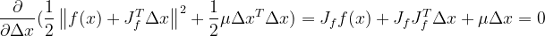

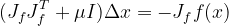

From the equation above, _**μI**_ is added as a penalty to the equation if the increment _**Δx**_ is too large. _**μ**_ is also known as the damping factor and _**I**_ is identity matrix. When _**μ**_ is a large number, the equation is similar as gradient descent. In contrast, the equation is close to Gauss-Newton algorithm when _**μ**_ is small number. Now we know that we are trying to keep _**Δx**_ in the trust region, but what do we base on when deciding the value of the damping factor, _**μ**_?

When _**Δx**_ increases the cost function, the damping factor _**μ**_ should be increased to reduce _**Δx**_ and this iteration should be rejected. In contrary, if _**Δx**_ from this iteration is able to decrease the cost function, _**μ**_ should be decrease to increase _**Δx**_ and converging speed.

A ratio _**ρ**_ which is defined as the ratio of changes in actual cost function to changes in approximate cost function after adding the new increment value _**Δx**_.

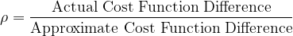

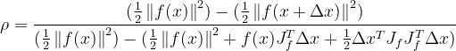

When _**ρ**_ is smaller than 0, it means that the cost function has increased in this iteration. As mentioned above, the damping factor _**μ**_ should then be increased to decrease increment in target value.
When _**ρ**_ is a large positive number, _**μ**_ should then be decreased to increase converging speed.
However, if _**ρ**_ is small positive number, _**μ**_ should still be increased to decrease step size.

There are many strategy when it comes to deciding the damping factor _**μ**_ and ratio _**ρ**_.
For instance, Marquardt's strategy looks like this.

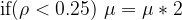

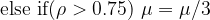

## Reference
[1] Y.He, X.Gao, C.Kun. Visual SLAM Online Course. shenlanxueyuan.com/my/course/225

[2] X.Gao, T.Zhao, Y.Liu, Q. Yan. 14 Lectures on Visual SLAM: From Theory to Practice. github/gaoxiang12/slambook-en