# IMU Preintegration

## IMU Measurements Model

In system such as visual-inertial system(VINS), measurements from inertial measurement unit(IMU) are crucial as they provide constraint in between poses. However, IMU measurements usually comes with high sampling frequency such as 200Hz. Therefore, these high frequency measurements have to be processed to form relative constraint in between poses. An IMU provides angular velocity readings from gyroscope and acceleration from its accelerometer. They can be modeled as below.

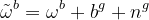

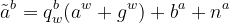

_**b**_ in these two equations denote the bias while _**n**_ represents the noise in the IMU model. The subscript _**b**_ can be seen as IMU body coordinate. The bias is often modeled as a random walk model while the noise can be modeled as Gaussian distribution with zero mean.

## Formulation of Preintegration Term

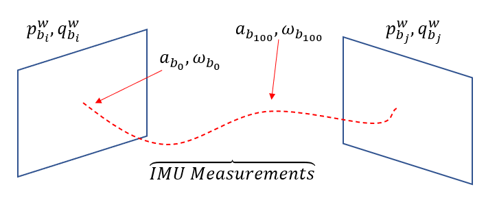

Imagine that we have 2 consecutive image frames, _**bi**_ and _**bj**_ just like the figure above. 
Between these two frames, we have numerous IMU measurements which consist of acceleration, _**a**_ and angular velocity, _**ω**_.
Using these readings, we can then formulate the poses of _**bi**_ and _**bj**_ as below.

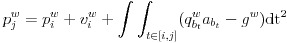

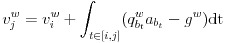

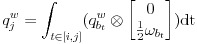

The equations above describe the relationship between _**bi**_ and _**bj**_ with the help of IMU measurements.
However, the equations rely on integration which requires _**bi**_.
In other word, we will need to redo all the integrations again if _**bi**_ updates or changes.
This is not realistic as IMU measurements can be as many as 200 per seconds and redoing 200 times integrations whenever one of the poses change can be ridiculously expensive.
Therefore, it is wiser to perform the integration only to determine the relative changes between frames due to IMU measurements.
This is when IMU Preintegration comes into play. As we know that rotation pose of _**bi**_ and _**bj**_ can be formulated as

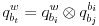

By subtituting this into previous equations, we can separate _**biw**_ term from the integration process. By doing so, the pose variables will not be included in the integration process. Note that the bias of the gyroscope and accelerometer are still exist in the preintegration process.

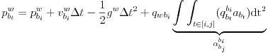

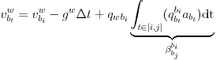

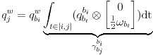

From the equations above, the preintegration terms, _**α**_, _**β**_, and _**γ**_ can then be calculated.
A more intuitive way of understanding the preintegration terms is that they are the relative translation, velocity, and rotation between two frames.
It is very useful to formulate as such in optimization-based backend as the preintegration can be used as constraint between poses.
Note that the bias is assumed to be unchanged between two frames.

## Residual Function
To be used in optimization-based backend, we will still have to formulate the preintegration term as a residual function. The residual function is shown as below.

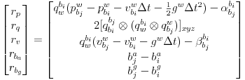

For the rotation residual function, we are using quaternion to calculate the residual. For product of two quaternion to be zero degree, it can be expressed as the equation below with the imaginary part of the quaternion to be zero and real part to be one.

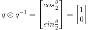

Therefore, the rotation residual function only consists of the imaginary values.

## Covariance Propagation

TO BE CONTINUE

## Reference

[1] T.Qin, P.Li, S.Shen. _VINS-MONO: A Robust and Versatile Monocular Visual-Inertial State Estimator._ arxiv.org/abs/1708.03852

[2] C.Foster, L.Carlone, F.Dellaert, D.Scaramuzza. _On-Manifold Preintegration for Real-Time Visual-Inertial Odometry._ arxiv.org/abs/1512.02363

[3] Y.He, X.Gao, C.Kun. _Visual SLAM Online Course._ shenlanxueyuan.com/my/course/225

[4] X.Gao, T.Zhao, Y.Liu, Q.Yan. _14 Lectures on Visual SLAM: From Theory to Practice._ github/gaoxiang12/slambook-en

